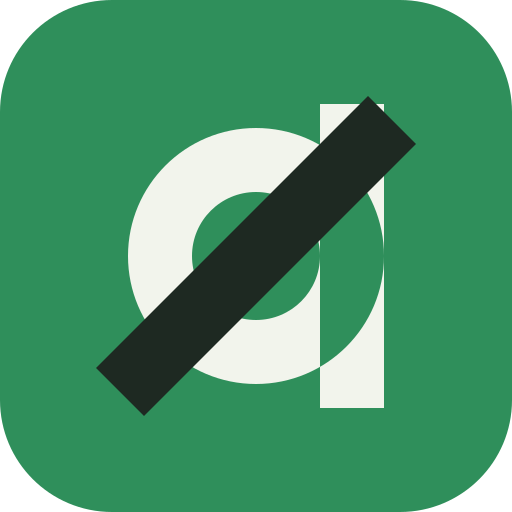

<div align="center">



# DERIVA

**Derive the algorithm. Don't memorize it.**

A production-grade, local-first platform for learning data structures and
algorithms through first-principles derivation — with an on-device AI tutor,
a creative studio, and a complete suite of offline tools.


</div>

---

## Why Deriva exists

Most learning platforms optimize for recognition: watch a video, recognize a
pattern, move on. Deriva optimizes for derivation. Every problem follows a
nine-stage flow — concept, reasoning, patterns, then implementation — where
each stage teaches exactly one thinking move. Naive solutions are always taught
before optimized ones, because the contrast is where the insight lives.
Curriculum content is authored as typed, zod-validated data; a curriculum error
is a build error, not a surprise for a student at midnight.

## The learning loop

Everything below runs client-side, works offline after first load, and installs
as a PWA (with a packaged Android TWA for store distribution).

| Surface | What it does |
|---|---|
| **Daily Challenge** | A new problem every day, tracked with streaks |
| **Review Queue** | Spaced repetition over everything you have attempted |
| **Guided Lessons** | Nine-stage derivations with typed execution traces powering every visualization |
| **Pattern Quiz / Drill Mode** | Retrieval practice across algorithm families and complexity analysis |
| **ICPC Ladder** | Contest-grade problem ladder with progression tracking |
| **Algorithm Atlas · Complexity Lab · Cheatsheets** | Reference systems built from the same validated data |
| **Game Mode · Expedition** | Timed and exploratory formats for when the loop needs variety |

Visualizations are pure functions of `(trace, cursor)` — the render layer never
executes code. Python execution happens inside a killable worker sandbox with
request IDs, hard timeouts, and abort signals.

## Ghost — an AI tutor that lives in your phone

Ghost runs a quantized SmolLM2 model (101 MB or 258 MB) entirely in the browser
through multithreaded WASM inference. One opt-in download into private OPFS
storage; from then on it works with the network off, permanently.

- Socratic by design: hints and guiding questions first, direct answers on demand
- Streaming responses, live tokens-per-second gauge, persistent conversation sessions
- Model lifecycle you control: install, switch, eject, delete — every deletion verified at the byte level
- Storage integrity gate verifies GGUF headers before load; damaged files self-repair by re-download
- A 120-second generation timeout makes an infinite hang impossible

## Studio

**OSC-1** — a pocket synthesizer. Sixteen steps, eight voices, sample-accurate
scheduling against the audio clock (never timers). Wave shaping, resonant
filter, dotted-eighth delay, swing and gate controls, four pattern slots,
song-chain mode, four faceplates, haptics, autosave. All pentatonic, so every
combination is musical. Playback continues across navigation behind a floating
transport badge.

**Glyph Studio** — draw dot-matrix light on 7/12/16 grids with animation
frames, onion skinning, glow and material controls, and pattern generators.
Export PNG, animated SVG, or JSON — or publish glyphs as a device-wide icon
pack rendered across the entire shell.

## Tools

QR studio (generation with live preview, universal camera scanning via jsQR),
image workbench (crop anywhere, resize, convert WebP/JPEG/PNG with drag-drop
and clipboard paste), expenses, calendar, translation, weather, whiteboard,
vault — each installed from the in-app Store, each offline-capable.

## Appearance system

Fourteen themes times custom accents, five type voices, density and shape
controls, texture options, and four icon-pack languages — including a personal
pack generated from your own Glyph drawings. Contrast is computed at runtime:
`--on-accent` derives its luminance from whatever theme-accent-custom
combination you choose, so text stays readable everywhere. Your exact look can
be exported as a QR code and imported on another device.

## Engineering notes

- Next.js App Router, strict TypeScript, pnpm
- 109 Vitest suites green; typecheck and build gates on every change
- Service-worker versioning with cache-first static strategy and stale-deploy self-healing: chunk failures trigger a one-shot purge and reload
- On-device diagnostics ring buffer surfaced in Settings
- Every architectural decision recorded as a D-entry in `docs/07-technology-decisions.md`

## Documentation

The `docs/` directory is the project constitution: product requirements,
learning philosophy, curriculum law, system architecture, folder boundaries,
persistence strategy, and the UI design system — in reading order, numbered.

## Getting started

```bash
git clone https://github.com/srivtx/deriva.git
cd deriva
pnpm install
pnpm dev        # http://localhost:3000
pnpm build      # production build
pnpm test       # vitest
```

Open `/ghost`, tap SUMMON GHOST once on Wi-Fi, then disconnect and keep
learning. Open `/osc` and make some noise.

## Privacy

There is no backend. Learning progress lives in IndexedDB and localStorage,
model weights live in private OPFS storage, audio never leaves the tab, and no
telemetry exists to send anything anywhere.
