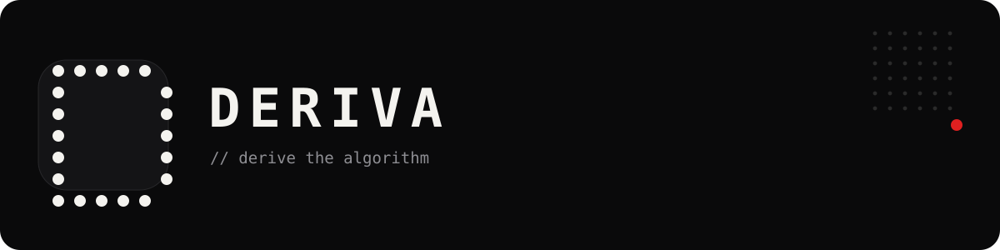

<div align="center">



**Derive the algorithm. Don't memorize it.**

An interactive platform for learning data structures & algorithms through
first-principles derivation — plus a full suite of personal instruments,
wrapped in an appearance system inspired by Nothing and Teenage Engineering.

[](https://nextjs.org)
[](https://www.typescriptlang.org)
[](#)
[](#)
[](#)

</div>

---

## Why Deriva exists

Most platforms train pattern-matching. Deriva trains **derivation** — every
problem walks a nine-stage flow from concept to working code, each stage
teaching exactly one thinking move. Naive solutions are taught before optimized
ones wherever the contrast teaches something. The trace is the product; every
visualization is a pure function of `(trace, cursor)`.

> Concepts → Reasoning → Patterns → Implementation. Code is Stage 6.

## The learning stack

| | App | Route | What you do there |
|---|---|---|---|
| ▶ | **Drill Mode** | `/practice` | Topic drills with full 9-stage derivations |
| ◈ | **Patterns** | `/patterns` | Learn the thinking moves, then quiz them |
| ☀ | **Daily Challenge** | `/daily` | One spaced pick per day |
| ⟳ | **Review Queue** | `/review` | Spaced repetition over everything solved |
| ⚑ | **ICPC Ladder** | `/icpc` | 75 contest problems, ranked |
| ◎ | **Algorithm Atlas** | `/atlas` | Watch algorithms move, step by step |
| ◔ | **Observatory** | `/observatory` | Your progress, honestly visualized |

## The instruments

Deriva is also a personal toolkit — local-first apps that live on your device:

| | App | What it does |
|---|---|---|
| ✺ | **Glyph Studio** | Draw dot-matrix light: 7/12/16 grids, animation frames, glow & material controls, export PNG / animated SVG / JSON — and save glyphs as your own icon pack |
| ◔ | **Focus Dial** | Braun-style rotary timer that re-tints the entire shell while it runs |
| ▤ | **Life Toolkit** | Tasks, habits, focus sessions |
| ⛨ | **Vault** | Encrypted personal storage |
| ❖ | **Apps Store** | Installable mini-apps: expenses, calendar, weather, translate, QR studio… |
| ⌘ | **Command Center** | `⌘K` to reach everything |

## Appearance system

Your device, your atmosphere — 100% local, endlessly combinable:

- **14 themes** × accent colors × **5 type voices** (including Doto *Dot Matrix*
  and Space Grotesk *Instrument*) × density × shape × texture
- **4 icon-pack languages**: Classic strokes · Nothing dot-bitmaps · OP-1
  thin-line pictograms · **Personal** (drawn by you in Glyph Studio)
- **Custom bottom nav**: pick slots, drag to reorder, style every icon
- **Logo marks**: Classic cipher / Nothing dot-D / OP-1 line-D — one source of
  truth feeds header, favicon and installed-app icon
- **Appearance QR codes**: carry your exact look between devices

A pre-paint boot script applies your theme before first paint — no flash of
defaults, ever, even cold-starting the installed app.

## Architecture

```
src/
├── app/            # Next.js App Router — one route per app above
├── components/     # Shell, editors, viewers, pack/icon system
├── data/           # Icon packs, nav registry, logo marks, share codes
├── persistence/    # Device-local preferences & daily state (localStorage)
├── notifications/  # Desktop reminders
└── lib/            # Self-healing recovery, diagnostics ring-buffer
docs/               # The constitution — read 01 → 06 before contributing
android/            # TWA project with launcher-icon product flavors
public/sw.js        # Network-first HTML, cache-first assets, self-healing
```

- **Typed curriculum**: lessons are zod-validated data — content errors are build errors
- **Self-healing PWA**: stale-deploy chunk failures purge caches and reload once; on-device error telemetry surfaces in Settings → System
- **Android TWA**: `./gradlew bundleClassicRelease | bundleNothingRelease | bundleOponeRelease`

## Getting started

```bash
pnpm install
pnpm dev          # develop at localhost:3000
pnpm typecheck    # strict tsc --noEmit
pnpm test         # vitest
pnpm build        # production build — fails on any curriculum/type error by design
```

Install it as an app from your browser's install prompt — everything works offline.

## Documentation

The [`docs/`](docs) suite is the constitution. Start at
[`01-product-requirements.md`](docs/01-product-requirements.md), then follow the
reading order. UI/appearance law lives in
[`09-ui-ux-design-system.md`](docs/09-ui-ux-design-system.md). Changes that touch
documented behavior update the doc in the same commit.

## Changelog & releases

See [CHANGELOG.md](CHANGELOG.md) and
[GitHub Releases](../../releases). Current: **v1.5.0 — Lucent Lab**.

---

<div align="center">
<sub>Built for one user first: me. Preferences stay on this device and never change the learning path.</sub>
</div>
